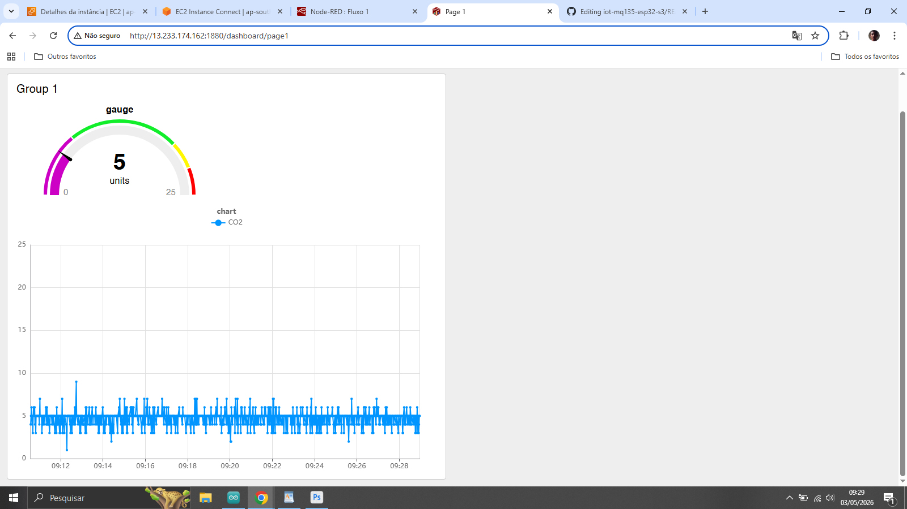
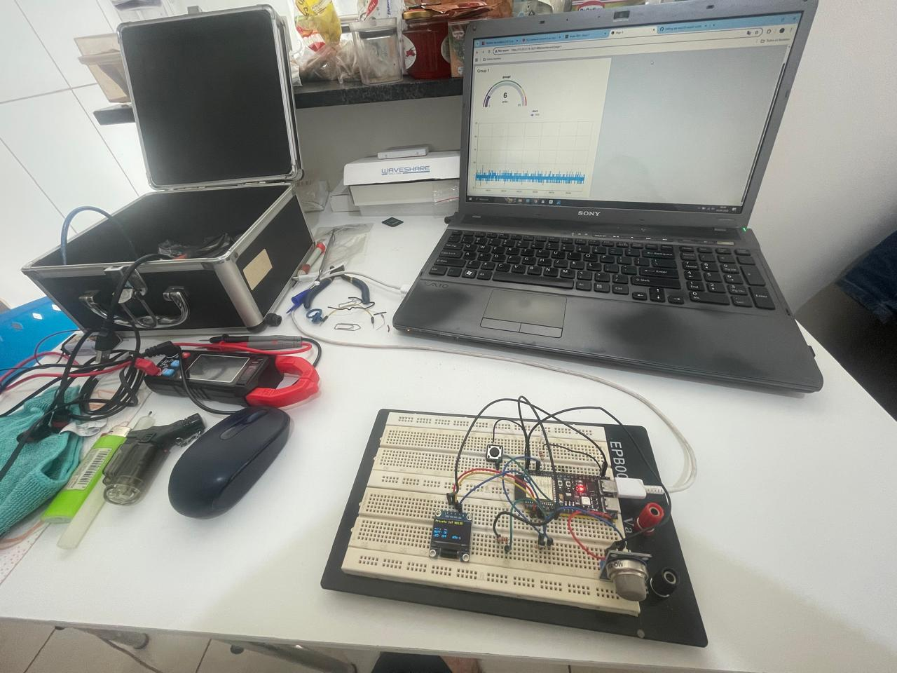
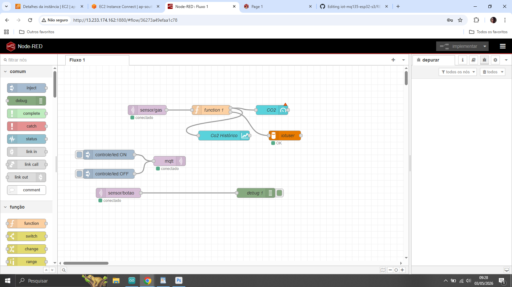
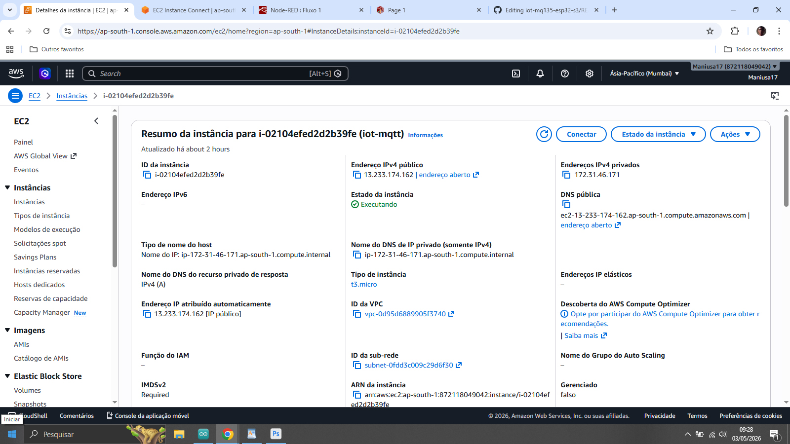

# 🌐 Sistema IoT para Monitoramento de Qualidade do Ar

### ESP32-S3 + MQ135 + MQTT + Node-RED + AWS

---

## 📌 Descrição

Este projeto implementa um sistema IoT completo utilizando o **ESP32-S3** para monitoramento da qualidade do ar através do sensor **MQ135**, com comunicação via **MQTT** e visualização em **Node-RED** hospedado na **AWS EC2**.

O sistema realiza a coleta, transmissão, processamento e exibição dos dados em tempo real.

---

## 📊 Funcionalidades

* Monitoramento em tempo real de gases (MQ135)
* Exibição local em display OLED (I2C)
* Envio contínuo de dados via MQTT
* Dashboard com gráfico histórico
* Controle remoto de LED
* Interação via botão físico
* Integração com servidor em nuvem (AWS EC2)

---

## 🧠 Arquitetura do Sistema

ESP32 → MQTT → Node-RED → Dashboard
                ↓
           Banco de dados (histórico)

---

## ⚙️ Tecnologias Utilizadas

* ESP32-S3
* Sensor MQ135
* Display OLED SSD1306 (I2C)
* MQTT (Mosquitto)
* Node-RED
* AWS EC2
* Arduino IDE

---

## 🔌 Hardware

* ESP32-S3 Dev Module
* Sensor MQ135
* Display OLED SSD1306
* LED + resistor
* Botão com pull-up interno

---

## 📡 Tópicos MQTT

| Função          | Tópico       |
| --------------- | ------------ |
| Sensor de gás   | sensor/gas   |
| Botão           | sensor/botao |
| Controle de LED | controle/led |

---

## 🌍 Servidor

Node-RED rodando em instância AWS EC2.

> ⚠️ O acesso ao dashboard pode estar restrito para demonstração ou ambiente local.

---

## 🚀 Como Executar

1. Suba o código no ESP32 via Arduino IDE
2. Configure WiFi e IP do broker MQTT no código
3. Inicie o servidor MQTT (Mosquitto) na EC2
4. Execute o Node-RED
5. Acesse o dashboard pelo navegador

---

## 📷 Imagens do Projeto

### 📊 Dashboard

### 🔧 Montagem (Protoboard)

### ⚙️ Node-RED

### ☁️ AWS EC2

---

## 🧪 Testes Realizados

* WiFi conectado com sucesso
* MQTT conectado
* Sensor enviando dados corretamente
* Botão detectado corretamente
* LED respondendo a comandos remotos
* Dashboard exibindo dados em tempo real

---

## 👨‍💻 Autor

**Rozmani Cezar Viveiros**
Pós-graduação em Internet das Coisas (IoT) – IFSP
Prof. Dr. Marcos Aparecido Chaves Ferreira
📅 30/04/2026

---

## 📌 Observações

Este projeto demonstra uma arquitetura completa de IoT, desde a aquisição de dados até a visualização e atuação remota, utilizando comunicação baseada em MQTT e processamento em nuvem.

---
